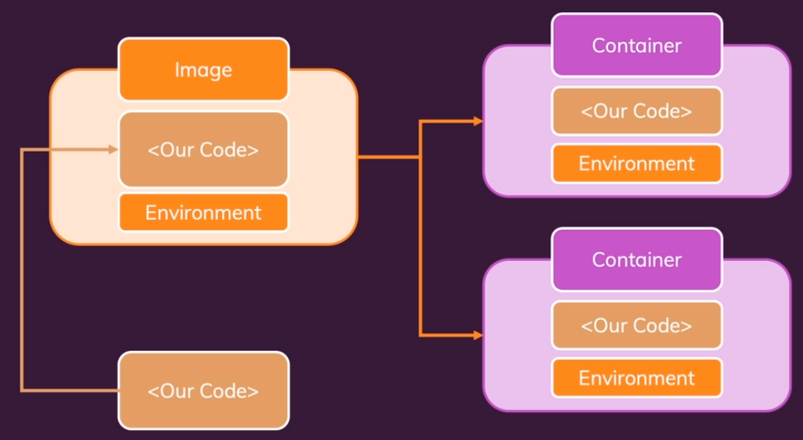

## About The Project

- Docker & Kubernetes: The Practical Guide [2022 Edition]
- Learn Docker, Docker Compose, Multi-Container Projects, Deployment and all about Kubernetes from the ground up!
- [Maximilian Schwarzmüller](https://github.com/maxschwarzmueller)
- [Academind](https://academind.com/)

&nbsp;

## Commands

```sh
# dockerfile
docker build .

# p flag publish on port 3000:3000 image id then visit localhost:3000
docker run -p 3000:3000 9134b990094eade5b78a511f9d423cb86736886a88c55426324b4da334c2ffea

# List all running containers
# docker processes
docker ps
# Stop NAME of container
docker stop elegant_ganguly

##############################################################

# nodejs-app folder
cd nodejs-app
docker build .
docker run -p 3000:3000 fb02
docker ps
docker stop magical_engelbart

# Rebuild after amending files in nodejs-app folder
docker build .
docker run -p 3000:3000 f244

# Restart container
docker ps -a
docker start youthful_hermann
```

&nbsp;

---

&nbsp;

## Basics

- [Docker](https://www.docker.com/) is a container technology: A tool for creating and managing containers.
  - <b>Environment: </b> The runtimes, languages & frameworks
  - Development environment and production environment are often not the same
- <b>Virtual Machines</b>

|                               Pro                                |                                     Con                                     |
| :--------------------------------------------------------------: | :-------------------------------------------------------------------------: |
|                      Separated environments                      |                    Redundant duplication, waste of space                    |
|         Environment-specific configurations are possible         |               Performance can be slow, boot times can be long               |
| Environment configurations can be shared and reproduced reliably | Reproducing on another computer/ server is possible but may still be tricky |

|                     Docker Containers                      |                        Virtual Machines                         |
| :--------------------------------------------------------: | :-------------------------------------------------------------: |
|   Low impact on OS, very fast, minimal disk space usage    |      Bigger impact on OS, slower, higher disk space usage       |
|       Sharing, re-building and distribution is easy        |    Sharing, re-building and distribution can be challenging     |
| Encapsulate apps/ environments instead of "whole machines" | Encapsulate "whole machines" instead of just apps/ environments |

- <b>Docker Tools & Building blocks</b>:
  - Docker Engine
  - Docker Desktop (incl. Daemon & CLI)
  - Docker Hub
  - Docker Compose

&nbsp;

---

&nbsp;

- Foundation

  - Images & Containers
  - Data & Volumes (in Containers)
  - Containers & Networking

- "Real Life"
  - Multi-Container Projects
  - Using Docker-Compose
  - "Utility Containers"
  - Deploying Docker Containers
- Kubernetes
  - Basics
  - Data & Volumes
  - Networking
  - Deploying a Kubernetes Clusters

&nbsp;

---

&nbsp;

### Images & Containers

|                  Images                  |                      Containers                       |
| :--------------------------------------: | :---------------------------------------------------: |
|   Templates/ Blueprints for containers   |            The running "unit of software"             |
| Contains code + required tools/ runtimes | Multiple containers can be created based on one image |

- Using Pre-Built & Custom Images
  - [Docker Hub](https://hub.docker.com/)
  - A container is base on an image
- Creating & Managing Containers


&nbsp;



|                         Images                         |                      Containers                      |
| :----------------------------------------------------: | :--------------------------------------------------: |
| Can be <b>tagged</b> (named) <i>-t, docker tag ...</i> |          Can be <b>named</b> <i>--name</i>           |
|       Can be <b>listed</b> <i>docker images</i>        | Can be <b>configured in detail</b> see <i>--help</i> |
|   Can be <b>analyzed</b> <i>docker image inspect</i>   |        Can be <b>listed</b> <i>docker ps</i>         |
| Can be <b>removed</b> <i>docker rmi, docker prune</i>  |        Can be <b>removed</b> <i>docker rm</i>        |

&nbsp;

---

&nbsp;
